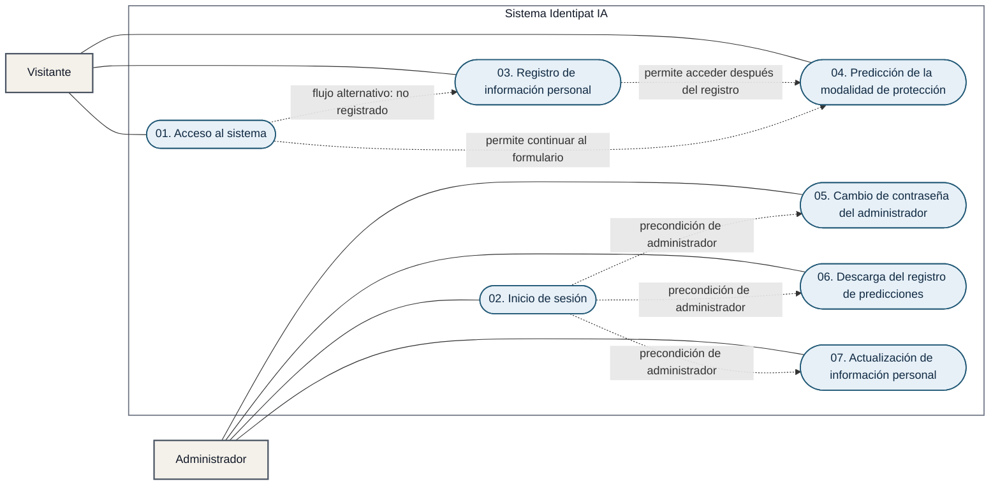

# Análisis Funcional Identipat IA

## 1. Introducción al análisis funcional

El presente documento de análisis funcional describe las necesidades, objetivos y comportamiento esperado del sistema Identipat IA, una herramienta basada en inteligencia artificial y procesamiento de lenguaje natural para apoyar la identificación de activos de propiedad intelectual en el Perú. Su propósito es establecer una visión clara y ordenada de la solución, considerando las funcionalidades que estarán disponibles para los usuarios visitantes y para el administrador del sistema.

El análisis funcional traduce las necesidades del negocio en requisitos comprensibles, verificables y orientados al desarrollo de la plataforma. Para ello, se detallan los procesos relacionados con el acceso al sistema, el registro y actualización de información personal, la predicción de la modalidad de protección, la gestión administrativa y la descarga de los resultados generados por la herramienta.

Asimismo, este documento sirve como referencia común para los participantes del proyecto, incluyendo las áreas usuarias, los responsables del análisis, el equipo de desarrollo y los encargados de validación. La definición de los casos de uso, actores, flujos principales y situaciones alternativas permitirá confirmar que la solución responda a los objetivos planteados, mantenga una experiencia coherente para sus usuarios y cumpla con las condiciones funcionales y legales aplicables.

---

## 2. Alcance del análisis funcional

El presente análisis funcional está basado en los requerimientos funcionales descritos en los Términos de Referencia (TDR) para el desarrollo de Identipat IA, una herramienta de inteligencia artificial orientada a la identificación de activos de propiedad intelectual en el Perú. El alcance comprende la descripción general del sistema y su acceso desde el portal institucional Patenta, la identificación de los actores que interactúan con la plataforma y el modelamiento de sus casos de uso. También considera la definición de los procesos principales mediante diagramas de actividad, la arquitectura del sistema y sus componentes, además de las condiciones generales de seguridad, privacidad, tratamiento de datos personales y uso responsable de la inteligencia artificial.

Asimismo, el análisis delimita las interacciones y responsabilidades de los usuarios visitantes y del administrador, considerando las condiciones necesarias para acceder a las funcionalidades de la plataforma. Esta definición permitirá representar de manera ordenada los flujos principales, las validaciones, las alternativas y las excepciones que pueden presentarse durante la utilización del sistema.

El análisis funcional incluye los ocho requisitos funcionales establecidos en los TDR: acceso a la plataforma; registro de información del usuario; ingreso de la descripción del activo mediante texto, voz o PDF; procesamiento de lenguaje natural; identificación de materia patentable mediante inteligencia artificial generativa; clasificación de la modalidad de protección; emisión y descarga de reportes de diagnóstico; y orientación complementaria sobre los requisitos y la ruta de registro. Asimismo, contempla la integración mediante mecanismos estandarizados, el enfoque agnóstico respecto del proveedor de IA y la inclusión de los avisos legales correspondientes.

El alcance también servirá para validar que cada requisito funcional tenga una respuesta dentro del diseño de la solución y pueda ser comprobado durante las pruebas. La documentación resultante facilitará la trazabilidad entre las necesidades descritas en los TDR, los casos de uso, los procesos modelados, los componentes técnicos y los criterios de aceptación que se definan para la construcción del sistema.

Este documento tiene como objetivo servir como referencia para el equipo de desarrollo, el equipo técnico institucional y los responsables funcionales del proyecto, permitiendo establecer un entendimiento común sobre el funcionamiento del sistema antes de iniciar las actividades de construcción y pruebas. También incluye consideraciones generales de la interfaz, entre ellas la implementación de un diseño responsive que permita la correcta visualización de la plataforma en distintos dispositivos.

---

## 3. Servicio de desarrollo de una herramienta de inteligencia artificial

### Identificación de activos de propiedad intelectual en el Perú

La herramienta estará basada en procesamiento de lenguaje natural.

### Objetivo del servicio

El objetivo de la consultoría es contratar los servicios especializados de una empresa para el desarrollo de una herramienta de inteligencia artificial basada en procesamiento de lenguaje natural para la identificación de activos de propiedad intelectual en el Perú, que incorpora funcionalidades técnicas, operativas y visuales.

---

## 4. Requisitos funcionales

Los requisitos funcionales del servicio establecidos en los Términos de Referencia son los siguientes:

### RF-01: Acceso a la plataforma

El sistema deberá permitir el acceso de los usuarios a la plataforma desde el portal institucional [www.patenta.pe](https://www.patenta.pe/), alojado en un servidor independiente. Asimismo, deberá mostrar de forma destacada información general sobre la herramienta, sus propósitos, el funcionamiento básico de sus algoritmos y el tipo de datos que se procesan, brindando pautas claras para su uso ético y consciente. Adicionalmente, el portal incluirá de manera visible los términos, condiciones y políticas de privacidad aplicables a su utilización.

### RF-02: Registro de información del usuario

El sistema deberá permitir registrar a los usuarios nuevos, almacenando información general como nombres, apellidos, correo electrónico y perfil del usuario. Asimismo, deberá reconocer a los usuarios previamente registrados mediante un identificador válido (DNI o Carné de Extranjería) para evitar la duplicidad de registros. El sistema integrará un mecanismo digital (casilla de verificación o equivalente) para capturar el consentimiento explícito, previo, libre e informado del usuario para el tratamiento de sus datos personales, conforme a la Ley N° 29733, impidiendo el avance en la plataforma si este no es otorgado.

### RF-03: Ingreso de descripción del activo

El sistema deberá permitir al usuario ingresar la descripción de su creación mediante lenguaje natural, a través de texto, voz o documentos en formato PDF. Asimismo, deberá exigir una longitud mínima de caracteres en la descripción, con el fin de garantizar un contexto suficiente para su procesamiento y análisis.

### RF-04: Procesamiento de lenguaje natural

El sistema deberá aplicar técnicas de procesamiento de lenguaje natural (PLN) y aprendizaje automático para preprocesar, transformar y analizar la descripción ingresada por el usuario, con el fin de obtener la información necesaria para su clasificación.

### RF-05: Identificación de materia patentable

El sistema deberá utilizar un servicio de IA generativa para analizar la descripción ingresada por el usuario y determinar si la creación descrita contiene materia susceptible de protección mediante patente, de acuerdo con los criterios establecidos en los artículos 15 y 20 de la Decisión 486 de la Comunidad Andina.

El servicio de IA generativa deberá ser compatible con el utilizado actualmente por el Indecopi en sus soluciones de inteligencia artificial (1). Asimismo, deberá incluir la capacidad de consumo necesaria para garantizar el funcionamiento del sistema durante un periodo mínimo de un (01) año, contado desde su puesta en producción.

La solución deberá diseñarse e implementarse bajo un enfoque agnóstico respecto del proveedor y de la tecnología de IA generativa. En ese sentido, no deberá incorporar dependencias innecesarias de componentes propietarios de una marca específica y deberá consumir el servicio mediante mecanismos de integración estandarizados, tales como API. Este enfoque deberá permitir la evolución de la solución y facilitar, de ser necesario, la sustitución del servicio o proveedor de IA generativa sin requerir modificaciones sustanciales en los demás componentes del sistema.

### RF-06: Clasificación de materia protegible

Cuando la creación contenga materia susceptible de protección mediante propiedad intelectual, el sistema deberá identificar y recomendar la modalidad de protección más probable, considerando, entre otras, las siguientes categorías: patente de invención, modelo de utilidad, diseño industrial, signos distintivos y derechos de autor, así como otras modalidades que sean identificadas durante la etapa de análisis.

### RF-07: Emisión de reportes de diagnóstico

El sistema deberá generar un reporte automatizado que indique el potencial de registro de la creación, proporcionando orientación práctica y recomendaciones sobre las modalidades de protección de propiedad intelectual aplicables. El reporte estará disponible para su visualización en el navegador web y descarga en formato PDF. El reporte generado deberá incluir de manera obligatoria y visible una cláusula de exención de responsabilidad jurídica (*disclaimer*), la cual especificará que los resultados constituyen una guía complementaria basada en IA y no reemplazan bajo ninguna circunstancia el juicio técnico, la evaluación experta ni las decisiones oficiales del personal examinador de la Entidad, salvaguardando el principio de supervisión humana.

### RF-08: Orientación complementaria y ruta de registro

El sistema deberá proporcionar información específica sobre cada modalidad de protección identificada, incluyendo los requisitos aplicables, pasos para su trámite, formatos de apoyo, tutoriales y/o enlaces a los servicios oficiales de asesoría correspondientes.

---

## 5. Diagrama de casos de uso del sistema Identipat IA

El diagrama presenta únicamente los siete casos de uso definidos para Identipat IA. Las actividades descritas dentro de cada flujo no se modelan como casos de uso adicionales.

### Relaciones principales

- El `visitante` puede acceder al sistema, registrar su información personal y realizar una predicción.
- El `administrador` debe iniciar sesión para utilizar las funciones administrativas.
- El caso 01 redirige al caso 03 cuando el visitante no está registrado y permite continuar al caso 04 cuando el usuario está registrado.
- El caso 03 permite acceder al caso 04 después de completar el registro correctamente.
- Los casos 05, 06 y 07 requieren que el administrador haya completado el caso 02.
- No se representan relaciones `<<include>>` entre los siete casos, porque las validaciones, consentimientos, procesamiento, búsqueda y generación de archivos son pasos internos de sus respectivos flujos, no casos de uso independientes definidos por el sistema.
- Los flujos alternativos, como datos inválidos, usuario no encontrado o consentimiento revocado, se mantienen dentro de la especificación de cada caso.

---

