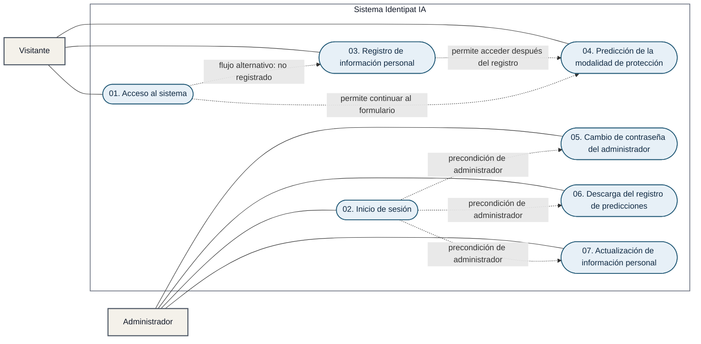

# Diagrama de casos de uso del sistema Identipat IA

El diagrama presenta únicamente los siete casos de uso definidos para Identipat IA. Las actividades descritas dentro de cada flujo no se modelan como casos de uso adicionales.

## Relaciones principales

- El `visitante` puede acceder al sistema, registrar su información personal y realizar una predicción.
- El `administrador` debe iniciar sesión para utilizar las funciones administrativas.
- El caso 01 redirige al caso 03 cuando el visitante no está registrado y permite continuar al caso 04 cuando el usuario está registrado.
- El caso 03 permite acceder al caso 04 después de completar el registro correctamente.
- Los casos 05, 06 y 07 requieren que el administrador haya completado el caso 02.
- No se representan relaciones `<<include>>` entre los siete casos, porque las validaciones, consentimientos, procesamiento, búsquedas y generación de archivos son pasos internos de sus respectivos flujos, no casos de uso independientes definidos por el sistema.
- Los flujos alternativos, como datos inválidos, usuario no encontrado o consentimiento revocado, se mantienen dentro de la especificación de cada caso.
